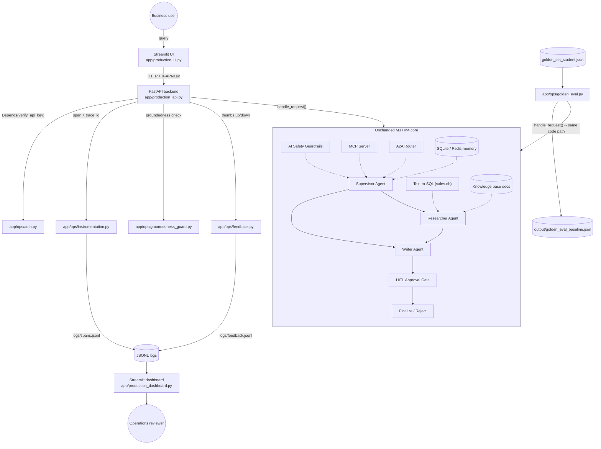

# Milestone-5 Architecture Note

## One-paragraph summary

Milestone 5 adds no new agents, tools, or business logic. It wraps the
unchanged Milestone-3 `ResearchAssistant` engine and Milestone-4
`GovernancePlatform` with five thin, additive layers -- a secured FastAPI
backend, a Streamlit UI, span-level instrumentation, a monitoring dashboard,
and a golden-set evaluation script -- so the same request/response contract
that already existed can be authenticated, observed, costed, and evaluated
before it is trusted in production.

## Diagram

## What each new box wraps (traceability)

| New file | Wraps / instruments / secures |
| --- | --- |
| `app/production_api.py` | `app.governance.platform.GovernancePlatform.handle_request()` -- no new routing/business logic, only auth, tracing, groundedness-guard, and feedback capture layered around the existing call. |
| `app/production_ui.py` | `app/production_api.py`'s `/query` and `/feedback` endpoints over plain HTTP (`httpx`) -- a true client/server split, not an in-process shortcut. |
| `app/ops/instrumentation.py` | Every `handle_request()` call made through the production API, recording name/duration/tokens/estimated cost under one shared `trace_id`. |
| `app/ops/groundedness_guard.py` | The final `answer` string already produced by `GovernancePlatform`/`ResearchAssistant` -- overrides it with an explicit refusal only when the question's own named entity or requested metric is verifiably absent from the retrieved content. |
| `app/ops/feedback.py` | The user's reaction to an answer already returned by the existing pipeline (thumbs up/down), keyed by the existing `trace_id`. |
| `app/production_dashboard.py` | The JSONL logs written by `app/ops/instrumentation.py` / `app/ops/feedback.py` -- pure read/aggregate/visualize, no new computation happens in the pipeline itself. |
| `app/ops/golden_eval.py` | `GovernancePlatform.handle_request()` again (same code path as the API), scored against `golden_set_student.json` using the reference-free metrics in `app/ops/eval_metrics.py`. |
| `app/ops/auth.py` | Every route registered on `app/production_api.py`, via a global `Depends(verify_api_key)`. |

## Request flow in / telemetry flow out

1. A business user submits a query through the Streamlit UI.
2. The UI sends it over HTTP (with `X-API-Key`) to the FastAPI backend.
3. The backend's `Depends(verify_api_key)` dependency runs first, on every
   route (including `/health`) -- an unauthenticated caller never reaches the
   governance layer at all.
4. The backend opens one `Tracer.trace()` (shared `trace_id`) and one
   `Tracer.span()` around the single call into the unchanged
   `GovernancePlatform.handle_request()`, which performs guardrail-check ->
   capability routing (MCP/A2A) -> guardrail-filter exactly as it did in
   Milestone 4.
5. The returned answer passes through the groundedness guard before being
   sent back to the UI; the span (name, duration, tokens, estimated cost,
   `trace_id`) is appended to `logs/spans.jsonl` regardless of outcome.
6. The UI renders the answer plus governance/trace metadata and offers a
   thumbs-up/down control, appended to `logs/feedback.jsonl` on click.
7. The monitoring dashboard and the golden-set evaluation script both read
   this same telemetry/engine independently, so what's on the dashboard and
   what's in the eval report both trace back to the one unchanged pipeline.

## Explicit disclosures

- The UI calls the FastAPI backend over real HTTP with `httpx`, not the
  pipeline directly -- a true client/server split (see `app/production_ui.py`).
- Every route on `app/production_api.py`, including `/health`, requires the
  API key -- a deliberate, literal reading of "every endpoint authenticated."
- The HITL approval step is the same `hitl_decision.txt` / approval-queue
  gate from Milestone 3; the golden-set evaluation script auto-approves it
  (`ApprovalUpdate(decision="PASS")`) purely so an unattended batch run can
  complete end to end -- the approval gate's PASS/FAIL behavior itself is
  already covered by `tests/test_milestone5_regression.py`.
