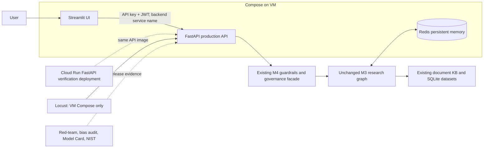

# Milestone 6 Production Architecture Note

Milestone 6 is an outer production ring around the unchanged M3 research
graph and M4 governance platform, plus the M5 tracing, groundedness, and
feedback layer. Docker Compose starts a FastAPI backend, a Streamlit client,
and the existing Redis persistent memory/retrieval service on one internal
network; the UI reaches the backend as `http://backend:8000`. This project
continues to use its existing local-document and SQLite retrieval approach,
so Redis is containerized as the established persistent semantic/episodic
store rather than introducing Qdrant late in the capstone. The public API
requires the M5 `X-API-Key` and an M6 short-lived Bearer JWT, while the
existing inbound/outbound prompt-injection guardrails remain the decision
point before any business flow runs. Cloud Run deploys the stateless FastAPI
image only for low-cost curl verification; Locust runs against the VM Compose
stack, preserving the GCP budget. The red-team, fairness audit, Model Card,
and NIST worksheet record release evidence instead of adding new agents or
business logic.